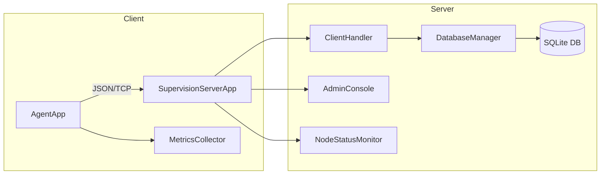

# Projet de Système de Supervision Distribué - M1 SRIV

Ce projet est une implémentation d'un système de supervision réseau basé sur une architecture client-serveur, réalisé dans le cadre du cours de Systèmes Répartis.

## Table des Matières

1. [Architecture](#architecture)
2. [Définition du Protocole](#définition-du-protocole)
3. [Structure du Projet](#structure-du-projet)
4. [Prérequis](#prérequis)
5. [Outils et Bibliothèques](#outils-et-bibliothèques)
6. [Installation et Lancement](#installation-et-lancement)
7. [Tests de Charge](#tests-de-charge)

---

## Architecture

Le système est conçu autour d'une architecture **client-serveur** classique, structurée en modules Maven séparés pour faciliter le développement, les tests et la maintenance.

### Composants principaux

* **Agent (Client)** : application Java légère exécutée sur chaque machine supervisée.
  * Collecte périodique (30 s) des métriques système :
    * ID du nœud, timestamp, OS, type de CPU
    * charge CPU/mémoire, utilisation disque, uptime
    * (extensions possibles : statut des services, ports, alertes)
  * Sérialisation JSON des données avec **Gson**
  * Envoi sur socket TCP vers le serveur central (`localhost:1234`)

* **Serveur (Central)** : application Java multithreadée gérant l'ensemble des agents.
  * **Écoute TCP** sur port 1234, pool de threads (`ExecutorService`) pour chaque connexion entrante.
  * Un **ClientHandler** par connexion lit, désérialise et traite les métriques.
  * **DatabaseManager** utilise **HikariCP** pour un pool de connexions vers une base SQLite
    afin de stocker les métriques de manière persistante.
  * **AdminConsole** fournit une CLI interactive : commandes `list-nodes`, `show-metrics`, `exit`, etc.
  * Un **NodeStatusMonitor** détecte les nœuds inactifs (absents pendant > T secondes).
  * Journaux via **SLF4J / Logback** (niveau DEBUG pour trafic, INFO pour events importants).

### Flux de données et diagramme



1. L'agent construit un objet métrique et le sérialise en JSON.
2. Les données transitent sur TCP vers le serveur.
3. Le serveur, via un thread du pool, désérialise et insère en base.
4. La console permet de requêter la DB et d'administrer le système.
5. Le moniteur révèle automatiquement les nœuds déconnectés.

### Structure du code

```
/projet-supervision/
|-- agent-client/             # Application client
|   |-- src/main/java/com/univ/sriv/agent
|   |   |-- AgentApp.java
|   |   `-- MetricsCollector.java
|   `-- pom.xml
|
|-- supervision-server/       # Application serveur
|   |-- src/main/java/com/univ/sriv/server
|   |   |-- SupervisionServerApp.java
|   |   |-- ClientHandler.java
|   |   |-- DatabaseManager.java
|   |   |-- AdminConsole.java
|   |   `-- NodeStatus*.java
|   `-- pom.xml
|
|-- shared-model/             # Modèle partagé (MetricData, etc.)
|   `-- pom.xml
|-- run_load_test.bat         # Script de test de charge Windows
|-- run_load_test.sh          # Script de test de charge Unix
|-- pom.xml                   # POM parent multi-modules
`-- README.md                 # Documentation (celle-ci)
```

Cette description remplace la nécessité d'un dessin externe ; elle reprend explicitement tous les composants et flux du système, tel qu'exigé par le cahier des charges du projet.
## Définition du Protocole

La communication entre l'agent et le serveur se fait via TCP et utilise le format JSON.

#### Message : Agent -> Serveur

L'agent envoie périodiquement un objet JSON avec la structure suivante :

```json
{
  "nodeId": "agent-01",
  "timestamp": 1678886400000,
  "os": "Windows 10",
  "cpuType": "Intel Core i7",
  "cpuLoad": 35.5,
  "memoryLoad": 62.0,
  "diskUsage": 45.2,
  "uptime": 12453
}
```

---

## Structure du Projet

Le projet est organisé en un projet Maven multi-modules pour une séparation claire des responsabilités.

```
/projet-supervision/
|
|-- agent-client/             # Module Maven pour l'application Agent
|   |-- src/main/java/
|   `-- pom.xml
|
|-- supervision-server/       # Module Maven pour l'application Serveur
|   |-- src/main/java/
|   `-- pom.xml
|
|-- shared-model/             # Module contenant le modèle de données partagé
|   |-- src/main/java/
|   `-- pom.xml
|
|-- run_load_test.bat         # Script de test de charge pour Windows
|-- run_load_test.sh          # Script de test de charge pour Linux/macOS
|-- pom.xml                   # POM parent qui gère les modules
`-- README.md                 # Cette documentation
```

---

## Prérequis

* **Java Development Kit (JDK)** : Version 11 ou supérieure.
* **Apache Maven** : Pour compiler le projet et gérer les dépendances.

---

## Outils et Bibliothèques

* **`Gson`** : Pour la sérialisation/désérialisation des objets Java en JSON.
* **`HikariCP`** : Pour la gestion d'un pool de connexions à la base de données, garantissant performance et fiabilité.
* **`SQLite-JDBC`** : Driver JDBC pour la base de données SQLite.
* **`SLF4J` & `Logback`** : Pour une journalisation (logging) flexible et puissante.

---

## Installation et Lancement

Suivez ces étapes depuis la racine du projet (`/projet-supervision/`).

#### 1. Compiler le Projet

Cette commande compile tous les modules et crée les fichiers `.jar` exécutables dans les dossiers `target` de chaque module.

```bash
mvn clean package
```

#### 2. Lancer le Serveur

Ouvrez un terminal et exécutez la commande suivante :

```bash
java -jar supervision-server/target/supervision-server-1.0-SNAPSHOT-jar-with-dependencies.jar
```

> 💡 **Sous Windows**, la console peut utiliser un encodage qui casse les accents.
> Il est recommandé d'utiliser le script `run_server.bat` qui active UTF-8 et lance le serveur correctement :
>
> ```bat
> .\run_server.bat
> ```
>
> Si vous préférez lancer manuellement, procédez comme suit :
>
> ```powershell
> chcp 65001
> java "-Dfile.encoding=UTF-8" -jar supervision-server/target/supervision-server-1.0-SNAPSHOT-jar-with-dependencies.jar
> ```

Le serveur va démarrer, créer le fichier de base de données `supervision.db` s'il n'existe pas, et se mettre en écoute des connexions.

#### 3. Lancer un Agent

Ouvrez un **nouveau** terminal et exécutez la commande suivante. Vous pouvez répéter cette étape dans plusieurs terminaux pour simuler plusieurs agents.

```bash
java -jar agent-client/target/agent-client-1.0-SNAPSHOT-jar-with-dependencies.jar agent-01
```

Dans un autre terminal :

```bash
java -jar agent-client/target/agent-client-1.0-SNAPSHOT-jar-with-dependencies.jar agent-02
```

#### 4. Utiliser la Console d'Administration du Serveur

Dans le terminal où le serveur s'exécute, vous pouvez taper des commandes :

* `list-nodes` : Affiche les agents actuellement connectés et leur dernière heure de contact.
* `show-metrics <nodeId>` : Montre les 10 dernières métriques enregistrées pour l'agent spécifié.
* `exit` : Arrête proprement le serveur.

---

## Tests de Charge

Pour simuler la connexion de nombreux clients simultanément, utilisez le script fourni correspondant à votre système d'exploitation. Il lancera 50 agents.

#### Sur Windows

```bat
run_load_test.bat
```

#### Sur Linux ou macOS

Rendez d'abord le script exécutable :

```bash
chmod +x run_load_test.sh
```

Puis lancez-le :

```bash
./run_load_test.sh
```
